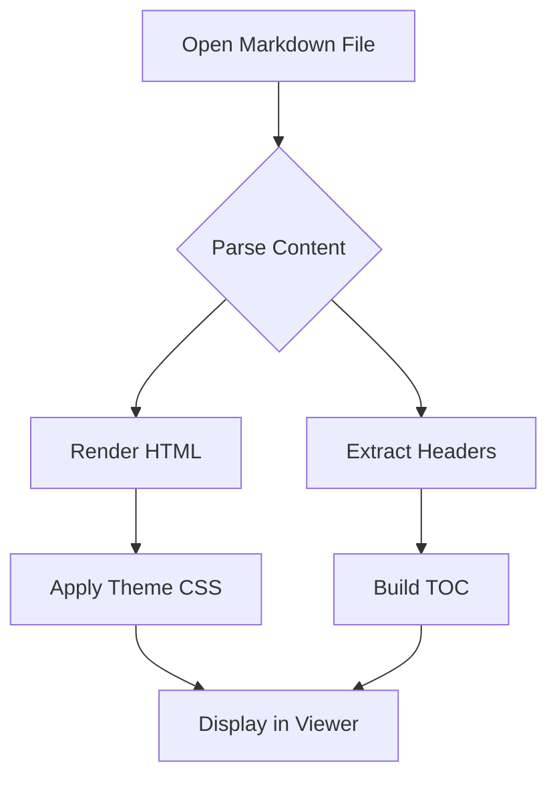
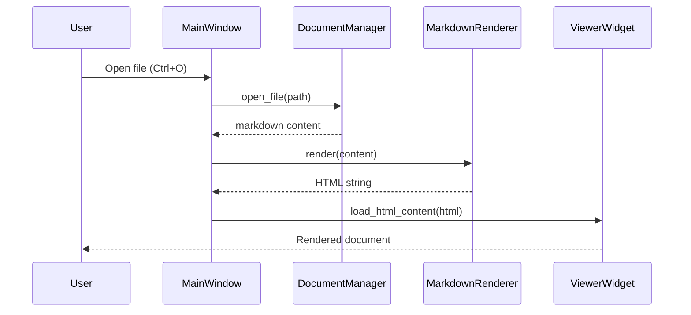
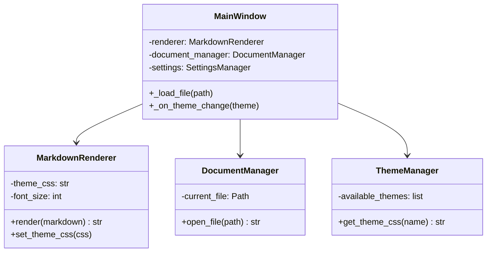
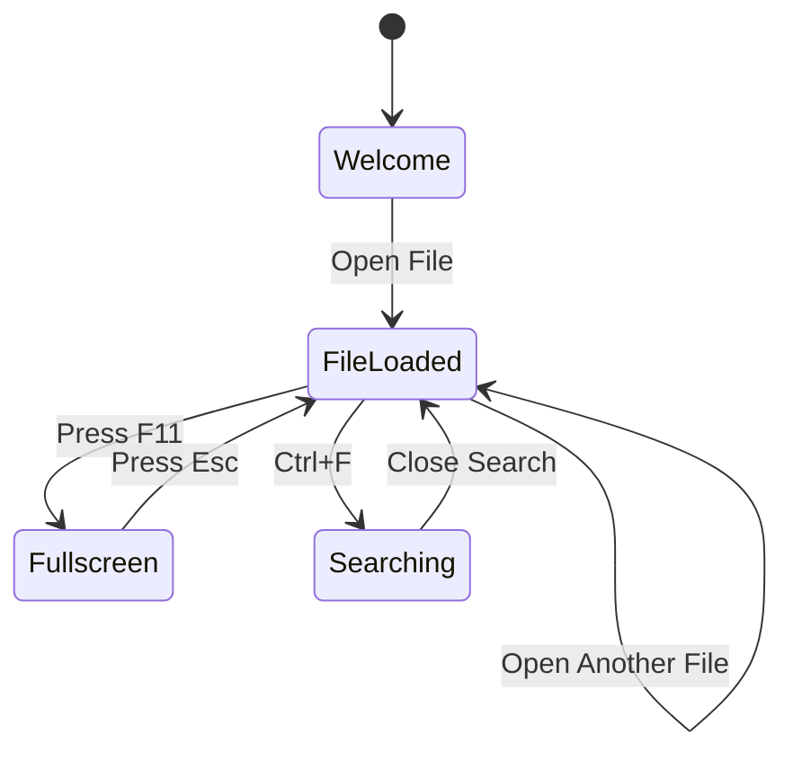
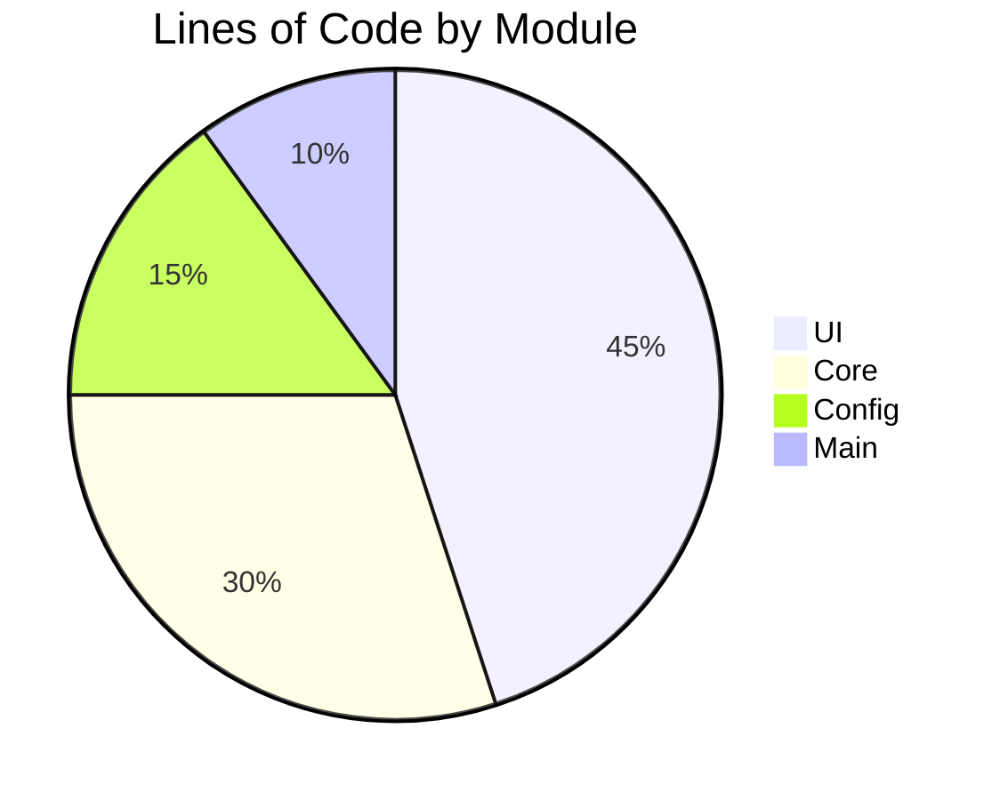
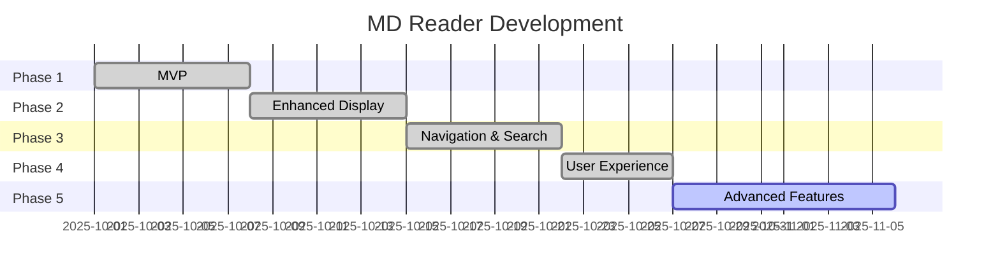

# Mermaid Diagram Demo

## Flowchart

```mermaid
graph TD
    A[Open Markdown File] --> B{Parse Content}
    B --> C[Extract Headers]
    B --> D[Render HTML]
    C --> E[Build TOC]
    D --> F[Apply Theme CSS]
    F --> G[Display in Viewer]
    E --> G
```

## Sequence Diagram

```mermaid
sequenceDiagram
    participant U as User
    participant MW as MainWindow
    participant DM as DocumentManager
    participant MR as MarkdownRenderer
    participant V as ViewerWidget

    U->>MW: Open file (Ctrl+O)
    MW->>DM: open_file(path)
    DM-->>MW: markdown content
    MW->>MR: render(content)
    MR-->>MW: HTML string
    MW->>V: load_html_content(html)
    V-->>U: Rendered document
```

## Class Diagram

```mermaid
classDiagram
    class MainWindow {
        -renderer: MarkdownRenderer
        -document_manager: DocumentManager
        -settings: SettingsManager
        +_load_file(path)
        +_on_theme_change(theme)
    }
    class MarkdownRenderer {
        -theme_css: str
        -font_size: int
        +render(markdown) str
        +set_theme_css(css)
    }
    class DocumentManager {
        -current_file: Path
        +open_file(path) str
    }
    class ThemeManager {
        -available_themes: list
        +get_theme_css(name) str
    }

    MainWindow --> MarkdownRenderer
    MainWindow --> DocumentManager
    MainWindow --> ThemeManager
```

## State Diagram

```mermaid
stateDiagram-v2
    [*] --> Welcome
    Welcome --> FileLoaded: Open File
    FileLoaded --> FileLoaded: Switch Theme
    FileLoaded --> FileLoaded: Open Another File
    FileLoaded --> Fullscreen: Press F11
    Fullscreen --> FileLoaded: Press Esc
    FileLoaded --> Searching: Ctrl+F
    Searching --> FileLoaded: Close Search
```

## Pie Chart

```mermaid
pie title Lines of Code by Module
    "UI" : 45
    "Core" : 30
    "Config" : 15
    "Main" : 10
```

## Gantt Chart

```mermaid
gantt
    title MD Reader Development
    dateFormat YYYY-MM-DD
    section Phase 1
        MVP                :done, p1, 2025-10-01, 7d
    section Phase 2
        Enhanced Display   :done, p2, after p1, 7d
    section Phase 3
        Navigation & Search :done, p3, after p2, 7d
    section Phase 4
        User Experience    :done, p4, after p3, 5d
    section Phase 5
        Advanced Features  :active, p5, after p4, 10d
```
